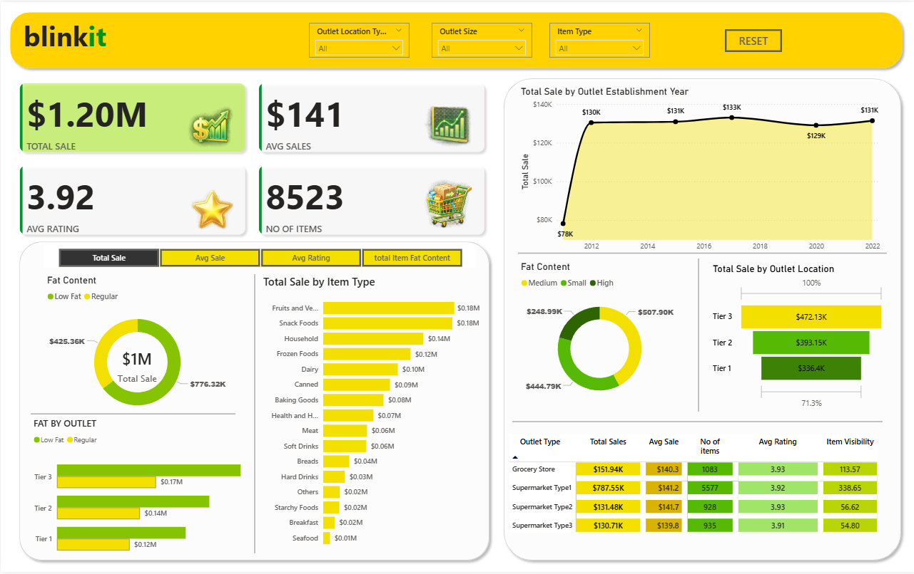

# 🛒 Blinkit Grocery Data Analysis Dashboard

## 📌 Project Overview
This project is an interactive **Power BI Dashboard** built using the Blinkit Grocery Sales dataset. The dashboard provides valuable insights into sales performance, customer ratings, outlet performance, and product categories, enabling data-driven business decisions.

---

## 📊 Dashboard Preview




---

## 🎯 Objectives

- Analyze overall sales performance
- Monitor key business KPIs
- Identify top-performing product categories
- Compare outlet performance by type and location
- Visualize sales trends over time
- Enable interactive filtering for better analysis

---

## 📈 Key Performance Indicators (KPIs)

- 💰 **Total Sales:** $1.20M
- 📦 **Total Items:** 8,523
- ⭐ **Average Rating:** 3.92
- 📊 **Average Sales:** $141

---

## 📌 Dashboard Features

- Sales Trend by Outlet Establishment Year
- Sales by Item Type
- Sales by Outlet Location
- Sales by Outlet Type
- Fat Content Analysis
- Interactive Filters (Slicers)
- KPI Cards
- Business Performance Summary

---

## 🛠️ Tools & Technologies

- Power BI
- Power Query
- DAX
- Microsoft Excel / CSV
- Data Modeling
- Data Cleaning
- Data Visualization

---

## 📂 Dataset

The dataset contains grocery sales information, including:

- Item Type
- Outlet Type
- Outlet Size
- Outlet Location
- Sales
- Ratings
- Fat Content
- Item Visibility
- Establishment Year

---

## 📊 Business Insights

- Tier 3 outlets generated the highest sales.
- Fruits & Vegetables and Snack Foods are the best-selling categories.
- Low Fat products contributed significantly to total sales.
- Supermarket Type 1 achieved the highest overall sales.
- Sales remained relatively stable after 2012.

---

## 📁 Repository Structure

```
Blinkit_sales_data_analysis/
│── BlinkIT Grocery Data.csv
│── blinkit.pbix
│── blinkit.sql
│── dashboard.png
│── README.md
```

---

## 🚀 Future Improvements

- Add Profit Analysis
- Customer Segmentation
- Inventory Dashboard
- Forecasting using Time Series
- Mobile Responsive Dashboard

---

## 👨‍💻 Author

**Mohit Mehta**

🔗 GitHub: https://github.com/Dynamict01

💼 LinkedIn: https://www.linkedin.com/in/mohit-mehta-726179307/

---

⭐ If you found this project useful, don't forget to Star this repository!
